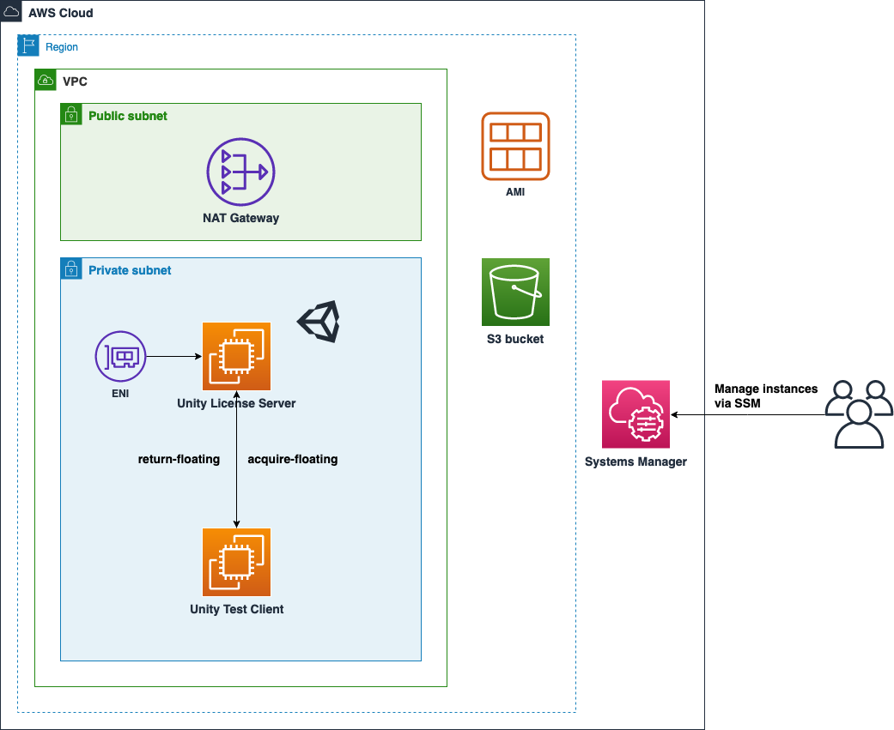

# Unity Build Server with AWS CDK

[View this page in Japanese (日本語版)](./docs/deployment_ja.md)

## Overview

This example helps you build a [Unity Build Server](https://unity.com/products/unity-build-server) (License server) for floating licenses with AWS CDK.



## Modules

This repository includes the following samples.

* AWS CDK Application
  * [/cdk](./cdk/) ([AWS CDK](https://github.com/aws/aws-cdk) project root for deployment)
* Documentation for deployment
  * [README - Getting Started](#getting-started)

## Prerequisites

* [Node.js](https://nodejs.org/en/download/)
  * v16 or higher is recommended
* [AWS CLI](https://docs.aws.amazon.com/cli/latest/userguide/getting-started-install.html)  ([View this page in Japanese](https://docs.aws.amazon.com/ja_jp/cli/latest/userguide/getting-started-install.html))
  * v2 is recommended
* Valid unassigned [Unity Build Server License](https://unity.com/products/unity-build-server)
  * Free trial licenses are recommended in PoC
* AWS IAM permissions (equivalent to Administrator) for AWS CLI
  * Attach an IAM role or input IAM user secrets with `aws configure`

## Installing AWS CDK

Run the command below to set up the environment for [AWS CDK](https://docs.aws.amazon.com/cdk/v2/guide/home.html) in `/cdk`.

```sh
# Install dependencies
npm ci

# Initialize your AWS environment
npx cdk bootstrap
```

## Getting Started
**NOTE**: If you want to deploy the system in your existing VPC, please edit [`cdk/bin/unity-build-server.ts`](cdk/bin/unity-build-server.ts) and set the VPC id.

### Deployment steps

1. Deploy the stack containing common AWS resources with AWS CDK:

    ```sh
    npx cdk deploy UnityLicenseServerStack
    ```

2. Create the AMI for the Unity license server
    * Follow the instructions [here](#how-to-create-the-ami-for-the-unity-license-server)
3. Deploy the Unity license server
    * Copy and paste the AMI ID created in the step 2 to `licenseServerAmiId` in `bin/unity-build-server.ts`, uncomment the line, and save
    * Deploy the stack again to apply the change:

    ```sh
    npx cdk deploy UnityLicenseServerStack
    ```

When you need to test the license server, see also [How to test the license server](#how-to-test-the-license-server).

### How to create the AMI for the Unity license server

Unity licenses are associated with the MAC address of the server (primary ENI for EC2 instance) and it's impossible to move to other servers.
In this sample, create an ENI and attach to the instance as a primary ENI.
By reusing the ENI, licenses are kept valid during launch.

**NOTE**: After assigning a license to an ENI, you cannot reassign your license to other ENI easily.
Please make sure your configuration (VPC, subnets, etc...) are valid BEFORE you activate the license.
If you want to make changes to those configuration, we recommend to set `retainEni` to `false` (in [`unity-build-server.ts`](cdk/bin/unity-build-server.ts)), which allows removal or replacement of the ENI resource.

Manual operations are needed to register the server and activate licenses since interaction with [Unity ID Portal](https://id.unity.com/en/account/edit) is unavoidable.

1. Upload the binary file (`Unity.Licensing.Server.linux-x64-{version}.zip`) downloaded from [Unity ID Portal](https://id.unity.com/en/account/edit) to the S3 Bucket (`Bucket` in `UnityLicenseServerStack`, The URL is displayed after `cdk deploy`)
    * Uploading from [AWS Management Console](https://s3.console.aws.amazon.com/s3/buckets) is recommended
    * Command example to upload with CLI:

    ```sh
    aws s3 cp ./Unity.Licensing.Server.linux-x64-v1.11.0.zip s3://unitylicenseserverstack-bucket-xxxxxxx/`
    ```

2. Deploy a stack to create an AMI
    * Run the command to deploy the stack to launch an EC2 instance:

    ```sh
    npx cdk deploy UnityLicenseServerAmiStack
    ```

    * Access to the instance (the URL is displayed after `cdk deploy`) in the stack via SSM and run the commands below:

    ```sh
    pwd
    # > /home/ssm-user

    # Input the S3 Bucket name in UnityLicenseServerStack
    BUCKET_NAME='unitylicenseserverstack-bucket-xxxxxxx'
    # Input the binary file name uploaded to the S3 Bucket
    ZIP_FILE_NAME='Unity.Licensing.Server.linux-x64-{version}.zip'
    aws s3 cp s3://$BUCKET_NAME/$ZIP_FILE_NAME ./
    # Create working directory for Unity.Licensing.Server
    mkdir UnityLicensingServer
    unzip $ZIP_FILE_NAME -d UnityLicensingServer/

    cd UnityLicensingServer
    # Start the interactive setup process
    ./Unity.Licensing.Server setup
    # ...setup phase example in the next section

    # Confirm the paths of server-registration-request.xml, services-config.json displayed and proceed to the next step

    # Upload server-registration-request.xml to the S3 Bucket
    aws s3 cp ./server-registration-request.xml s3://$BUCKET_NAME/
    # > upload: ./server-registration-request.xml to s3://xxxxxx/server-registration-request.xml\

    # Upload services-config.json to the S3 Bucket
    aws s3 cp ./services-config.json s3://$BUCKET_NAME/
    # > upload: ./services-config.json to s3://xxxxxx/services-config.json

    # Disconnect from the instance via SSM and proceed to the operation on AWS Management Console and Unity ID Portal.
    ```

3. Download `server-registration-request.xml` from the S3 Bucket to your local machine. According to [the guide](https://docs.unity3d.com/licensing/manual/QuickStartWeb.html), upload the request file to [Unity ID Portal](https://id.unity.com/en/account/edit), assign seats, and download the license zip file ({license server name}.zip)

4. Upload the license zip file to the S3 Bucket

5. Connect to the instance via SSM again and run the commands below (Please read [the guide](https://docs.unity3d.com/licensing/manual/QuickStartWeb.html) for more detailed information)

    ```sh
    # Input the S3 Bucket name in UnityLicenseServerStack
    BUCKET_NAME='sample-bucket-name'
    # Input the license zip file name uploaded to the S3 Bucket
    ARCHIVE_ZIP_FILE_NAME='unitylicenseserver.zip'
    # Copy the license zip file
    aws s3 cp s3://$BUCKET_NAME/$ARCHIVE_ZIP_FILE_NAME ~/
    # > download: s3://xxxxxx/yyyyyy.zip to ./yyyyyy.zip

    # Import license files
    cd UnityLicensingServer/
    ./Unity.Licensing.Server import ~/$ARCHIVE_ZIP_FILE_NAME

    # Confirm the message 'Successfully imported licensing files. You may run the server.' is displayed

    # Register Unity License Server as a system service
    sudo ./Unity.Licensing.Server create-service

    # Check functionality of the license server (the ip address is written in services-config.json)
    curl http://xxx.xxx.xxx.xxx:8080/v1/admin/status | jq .
    ```

6. Create an AMI of the license server from AWS Management Console
    * [User Guide for Linux Instances](https://docs.aws.amazon.com/toolkit-for-visual-studio/latest/user-guide/tkv-create-ami-from-instance.html)
    * It takes about 10 minutes to be completed, and please wait before proceeding to the next step

7. Copy and paste the AMI ID created in the step 6 to `licenseServerAmiId` in `bin/unity-build-server.ts`, uncomment the line, and save

8. Destroy the stack used to create the AMI and free the ENI from the instance

    ```sh
    npx cdk destroy UnityLicenseServerAmiStack
    ```

9. The steps to create the AMI is over. Return to [Deployment Steps](#deployment-steps) and continue the deployment

### Interactive setup example

This is an example of the interactive setup process with the binary file downloaded from [Unity ID Portal](https://id.unity.com/en/account/edit) (`./Unity.Licensing.Server setup`)

```sh
- - - -
Welcome to Unity Licensing Server setup command line interface.
This setup will help you configure your license server and generate server registration request file.
- - - -

# Input any server name. It will be used in Unity ID Portal to identify servers
Enter the server name (e.g. LicenseServer): [unitylicenseserver.ec2.internal] unitylicenseserver
Do you want the licensing server to use HTTPS? [Y/n] n
List of available network interfaces on this host

  - [1] lo (00:00:00:00:00:00) 127.0.0.1
  - [2] eth0 (02:D4:86:51:CD:E0) 10.0.171.141
Enter the index number of the network interface which server will operate on: 2
Enter server's listening port number (between 1025 and 65535): [8080]
Add default addresses to the Admin IP Allowlist (127.0.0.1, ::1, 10.0.171.141)? [Y/n] y
List of current allow-listed admin IP addresses:
  - 127.0.0.1
  - ::1
  - 10.0.171.141
Add an additional admin IP address to the allow list? [y/N] n

Generating signing key... Done

Generating server configuration ...Done
Generating services configuration ...Done
Reloading configuration... Done
Generating server registration request file... Done

- - - -
Setup Completed!
- - - -
```

### How to test the license server

#### Test with a client included in this sample

When you check the license server with a client included in this repository, follow the instructions below.

1. Run the command to deploy the stack contains the test client:

    ```sh
    npx cdk deploy UnityTestClientStack
    ```

    * Dependencies, tools and configuration files are installed automatically

2. Connect to the test client via SSM and run commands to acquire and return the floating license

    ```sh
    # Acquire the floating license
    $ /opt/unityhub/UnityLicensingClient_V1/Unity.Licensing.Client --acquire-floating
    Trying to acquire floating license from: 10.0.183.235 ...
    License lease state: "Created" with token: "5ae15de4-132c-49fa-8893-6e0962459014" expires at: "2023-01-17T07:12:41.7537236Z" (in local time: "2023-01-17T07:12:41.7537236+00:00")

    # Return the floating license
    $ TOKEN=5ae15de4-132c-49fa-8893-6e0962459014
    $ /opt/unityhub/UnityLicensingClient_V1/Unity.Licensing.Client --return-floating $TOKEN
    Trying to return floating license lease (5ae15de4-132c-49fa-8893-6e0962459014) to: 10.0.183.235 ...
    Failed to remove license file: /home/ssm-user/.config/unity3d/Unity/licenses/5ae15de4-132c-49fa-8893-6e0962459014.xml
    Exception: Could not find a part of the path '/home/ssm-user/.config/unity3d/Unity/licenses/5ae15de4-132c-49fa-8893-6e0962459014.xml'.
    License lease returned successfully
    ```

3. Delete the stack after checking the operation

    ```sh
    npx cdk destroy UnityTestClientStack
    ```

#### Use with the Unity Editor

In order to acquire a floating license from the Unity license server, place `services-config.json` to `/usr/share/unity3d/config/` in the client. Please refer to the commands below.

```sh
mkdir -p /usr/share/unity3d/config/
# Input the IP address of the Unity license server here
SERVER_IP_ADDRESS=xxx.xxx.xxx.xxx
UNITY_BUILD_SERVER_URL=http://$SERVER_IP_ADDRESS:8080
echo '{
"licensingServiceBaseUrl": "'"$UNITY_BUILD_SERVER_URL"'",
"enableEntitlementLicensing": true,
"enableFloatingApi": true,
"clientConnectTimeoutSec": 5,
"clientHandshakeTimeoutSec": 10}' > /usr/share/unity3d/config/services-config.json
```

When you launch Unity Editor with Batch Mode, the floating license is acquired and released automatically.

## Clean Up

**Attention!: You can't use and recover Unity licenses assigned to the ENI in the stack by yourself after you delete it. You need to contact Unity support for recovery.**

First, you have to change the removal policy of your ENI. You can do this easily by editing [`cdk/bin/unity-build-server.ts`](cdk/bin/unity-build-server.ts) like the below:

```diff
const serverStack = new UnityLicenseServerStack(app, 'UnityLicenseServerStack', {
  env,
-  retainEni: true,
+  retainEni: false,
});
```

Then deploy the stack:

```
npx cdk deploy UnityLicenseServerStack
```

After the deployment, run the following command to delete all resources and stacks:

```sh
npx cdk destroy --all
```

You need to manually delete the AMI that was created in the deployment.
See also [User Guide](https://docs.aws.amazon.com/AWSEC2/latest/UserGuide/deregister-ami.html).

## FAQ

Q1: How to renew the Unity Build Server license?

Answer: Download licenses from Unity ID Portal and import them again. See also [this website](https://support.unity.com/hc/en-us/articles/5041642079636) for more detailed information.

## Security

See [CONTRIBUTING](CONTRIBUTING.md#security-issue-notifications) for more information.

## License

This library is licensed under the MIT-0 License. See the LICENSE file.
